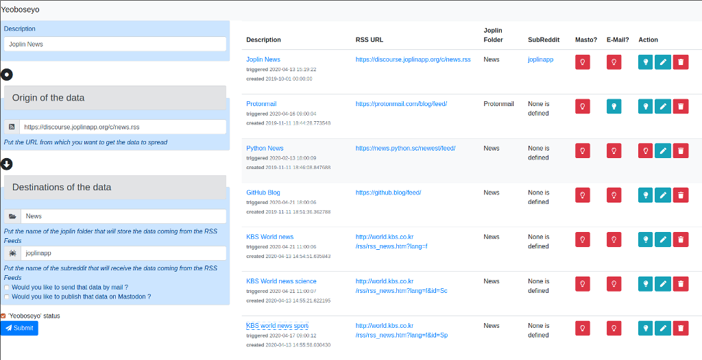

# 여보세요

let's the services say "hello" (여보세요 in Korean : `yeoboseyo`) to each others

This `hello` can be any data you want to get and send from any internet service to another

Services covered:

- Joplin markdown editor
- RSS Feeds
- Mastodon
- Reddit

So today, you can read RSS Feeds and this will:
* create notes in Joplin automatically in the folder you defined in the form
* post "toot" to your mastodon account
* post stuff to the subreddit of your choice

## Installation

create a virtualenv

```bash
python3.6 -m venv yeoboseyo
cd yeoboseyo
source bin/activate
pip install -r requirements.txt
```

## Database

create the database (to execute only once)
```bash
python models.py
```

## Settings
```bash
mv env.sample .env
```
set the correct values for your own environment
```ini
DATABASE_URL=sqlite:///db.sqlite3
TIME_ZONE=Europe/Paris
JOPLIN_URL=http://127.0.0.1
JOPLIN_PORT=41184
JOPLIN_TOKEN=  # put the token you can find in the webclipper page of joplin editor
FORMAT_FROM=markdown_github
FORMAT_TO=html
BYPASS_BOZO=False   # if you don't want to get the malformed RSS Feeds set it to False
LOG_LEVEL=logging.INFO
MASTODON_USERNAME=  # your mastodon username
MASTODON_PASSWORD=  # your mastodon password
MASTODON_INSTANCE=https://mastodon.social  # your mastodon instance
REDDIT_CLIENT_ID=   # see below explanation
REDDIT_CLIENT_SECRET= # see below explanation
REDDIT_PASSWORD=   # put your reddit password
REDDIT_USERAGENT=Yeoboseyo/1.0   # whatever :P
REDDIT_USERNAME=  #put your reddit login
```

## Mastodon Service
once your settings are ready run the following commands once

```bash
python mastodon_create_app.py
```
this will create an app named 'Yeoboseyo' with the username/pass you provided in the `.env` setting file .

this command will also create a file named `yeoboseyo_clientcred.secret` containing the token allowing us to publish stuff automatically.

## Reddit service

you will need to declare an app from this page [https://www.reddit.com/prefs/apps](https://www.reddit.com/prefs/apps)

* enter th name of your app (eg "Yeoboseyo")
* select 'script'
* fill a description (eg "The bus for your internet services - an opensource alternative to IFTTT.com")
* about url : http://localhost
* redirect url : http://localhost/callback
then press create ; once it's done
in the frame you see the name "Yeoboseyo" under it "personal use script" and under it ; the precious REDDIT_CLIENT_ID, then the REDDIT_CLIENT_SECRET
Use those info to fill the `.env` file 

## Running the Web application

start the application
```bash
cd yeoboseyo
python app.py &여보세요 !
INFO: Started server process [13588]
INFO: Waiting for application startup.
INFO: Uvicorn running on http://0.0.0.0:8000 (Press CTRL+C to quit)
```


### Adding some Feeds to track

Go on http://0.0.0.0:8000 and fill the form to add new Feeds to track

* If you plan to publish RSS Feeds into a joplin note, fill the "Joplin folder" field (and don't forget to start your joplin desktop version of course), if not leave it empty.
* If you plan to publish RSS Feeds on your Mastodon account, check the checkbox "Publish on Mastodon?", if not, leave it unchecked


Yeoboseyo home page



### Running the engine

now that you fill settings, and form, launch the command and see how many feeds are comming
```bash
python run.py

여보세요 ! RUN and GO
Trigger FoxMasK blog
 Entries created 1 / Read 1

```

RSS Source 


Publication on Mastodon


## Monitoring, managing triggers

# get the list
get the list of your feeds to check which one provided articles or not
```bash
python report.py

여보세요 ! Report
ID    Name                           Triggered              Notebook                       Mastodon Status
    1 FoxMasK blog                   2019-04-30 22:01       internet                              1      1     
```

# swtich the status of a trigger
switch the status of trigger to on/off
```bash
python switch.py 1

여보세요 ! Switch
Successfully switched Trigger 'FoxMasK blog' to True
```
and check it again to see the status moving 
```bash
python report.py

여보세요 ! Report
ID    Name                           Triggered              Notebook                       Mastodon Status
    1 FoxMasK blog                   2019-04-30 22:01       internet                              1      0
```
